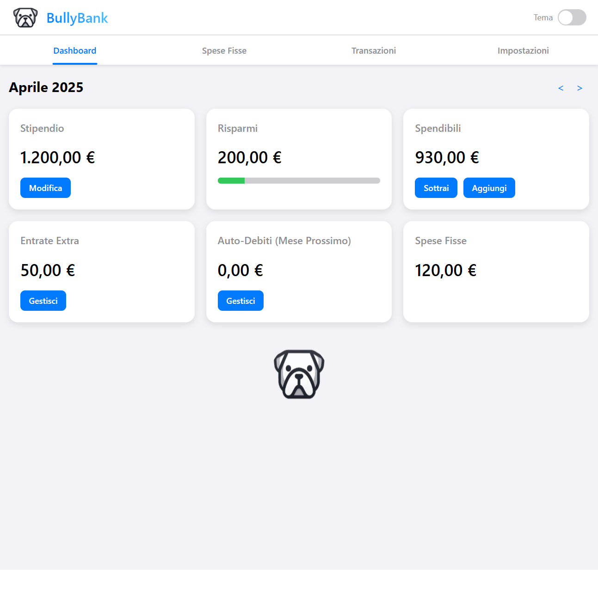
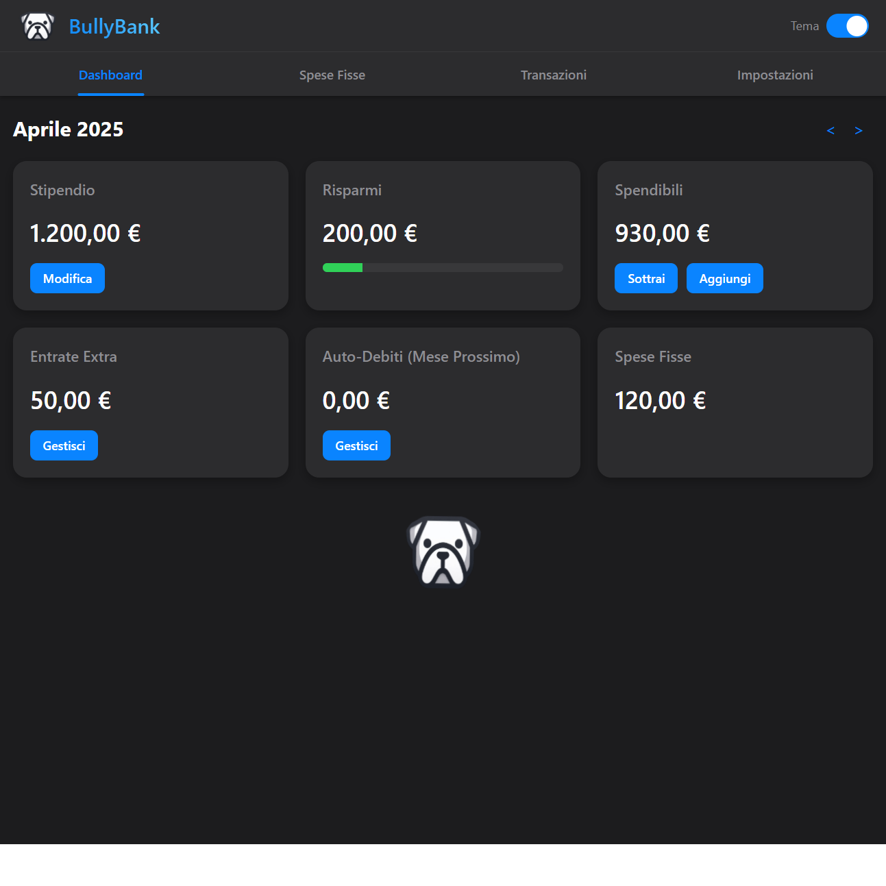
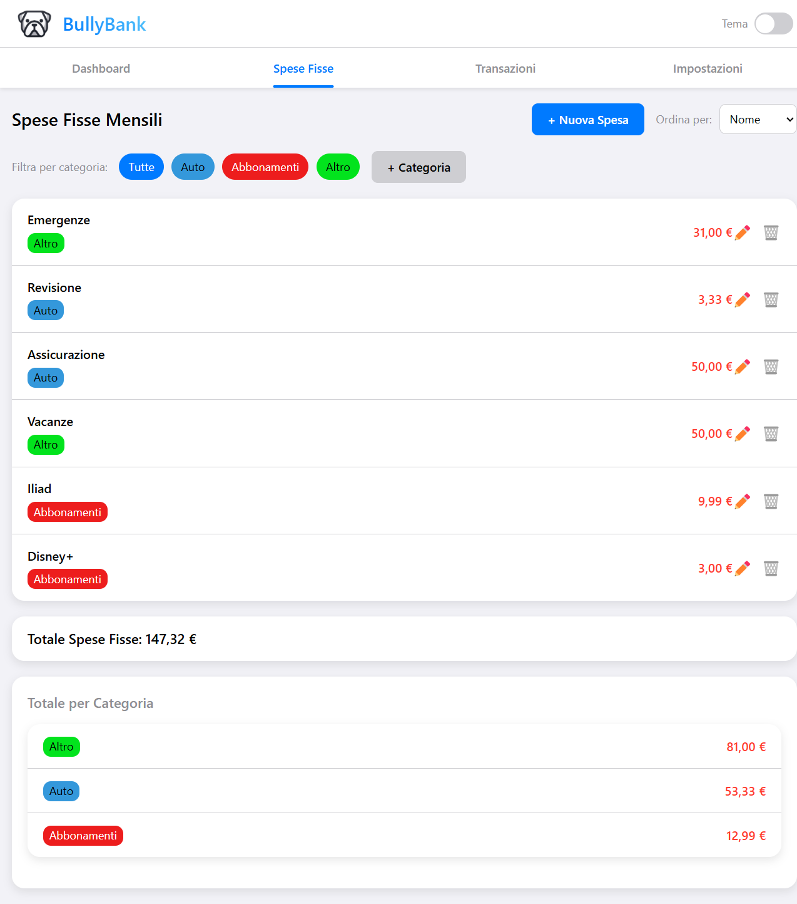

# BullyBank - Gestione Risparmi

BullyBank è un'applicazione web completa per la gestione personale dei risparmi e delle finanze, progettata con un'interfaccia in stile iOS/Apple. L'app funziona interamente nel browser e salva tutti i dati localmente sul dispositivo dell'utente, garantendo privacy e accessibilità senza necessità di server esterni.

 <!-- Aggiungi uno screenshot della dashboard principale -->

## Caratteristiche principali

- **Gestione completa del budget mensile**
  - Inserimento e modifica dello stipendio mensile
  - Monitoraggio dei risparmi e degli importi spendibili
  - Tracciamento di entrate extra e debiti

- **Gestione spese fisse**
  - Organizzazione per categorie personalizzabili
  - Ordinamento per nome, categoria o importo
  - Visualizzazione del totale per categoria

- **Interfaccia responsive**
  - Progettata per funzionare su desktop, tablet e smartphone
  - Navigation bar su desktop/tablet
  - Tab bar in stile iOS su smartphone

- **Personalizzazione**
  - Scelta tra tema chiaro e scuro
  - Categorie personalizzabili con colori a scelta

- **Backup e sicurezza**
  - Esportazione e importazione dei dati
  - Opzione per cancellare tutti i dati

 <!-- Aggiungi uno screenshot del tema scuro -->

## Come utilizzare l'app

### Dashboard

La dashboard mostra un riepilogo della situazione finanziaria del mese corrente:

- **Stipendio**: Visualizza e gestisce lo stipendio mensile
- **Risparmi**: Mostra l'importo destinato al risparmio con indicatore di progresso
- **Spendibili**: Indica l'importo disponibile per le spese, al netto dei risparmi e delle spese fisse
- **Entrate Extra**: Gestisce entrate aggiuntive oltre lo stipendio
- **Debiti Auto**: Monitora i debiti auto-inflitti da sottrarre il mese successivo
- **Spese Fisse**: Riassunto delle spese fisse mensili

### Spese Fisse

Questa sezione permette di gestire tutte le spese ricorrenti:

- Aggiungere, modificare ed eliminare spese fisse
- Filtrarle per categoria
- Visualizzare il totale complessivo e per categoria
- Ordinare la lista secondo diversi criteri

 <!-- Aggiungi uno screenshot della sezione spese fisse -->

### Transazioni

La sezione transazioni mostra uno storico di tutte le operazioni finanziarie:

- Stipendio e modifiche
- Entrate extra
- Sottrazioni dagli spendibili
- Debiti

### Impostazioni

Da qui è possibile:

- Esportare i dati in un file cifrato
- Importare un backup precedente
- Cancellare tutti i dati
- Gestire le categorie personalizzate
- Cambiare il tema dell'app

## Tecnologie utilizzate

- **HTML5**: Per la struttura dell'applicazione
- **CSS3**: Per lo stile e il design responsivo
- **JavaScript puro**: Per tutta la logica dell'applicazione
- **LocalStorage**: Per il salvataggio dei dati sul dispositivo

## Installazione

Non è richiesta alcuna installazione specifica. BullyBank è una web app che funziona direttamente nel browser. 

Per utilizzarla:

1. Scarica il file HTML
2. Apri il file nel tuo browser preferito
3. Inizia a gestire i tuoi risparmi!

E' anche disponibile pubblicato: [BullyBank](https://appbullybank.netlify.app/).

## Sicurezza e privacy

Tutti i dati vengono salvati esclusivamente sul dispositivo dell'utente utilizzando localStorage. Nessun dato viene inviato a server esterni. I backup esportati sono codificati in Base64 per una sicurezza di base.

## Contribuire

Sentiti libero di fare fork del repository e inviare pull request per migliorare l'applicazione. Alcune idee per possibili miglioramenti:

- Aggiungere grafici più dettagliati per l'analisi delle spese
- Implementare un sistema di obiettivi di risparmio
- Migliorare la cifratura dei backup
- Aggiungere la sincronizzazione tra dispositivi

## Licenza

Questo progetto è distribuito con licenza MIT.

## ✅ TODO List
- [ ] Build APK
- [ ] Aggiungere possibilità di esportare i dati in PDF/Excel
- [ ] In Dashboard aggiungere grafico a torta per favorire lettura
- [x] All'inserimento dello stipendio possibilità di vedere un anteprima degli spendibili 

---

Per domande o suggerimenti, apri un issue sul repository GitHub.
